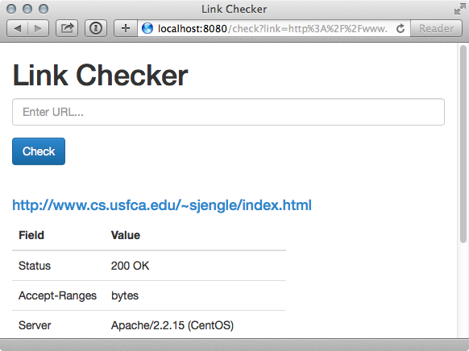
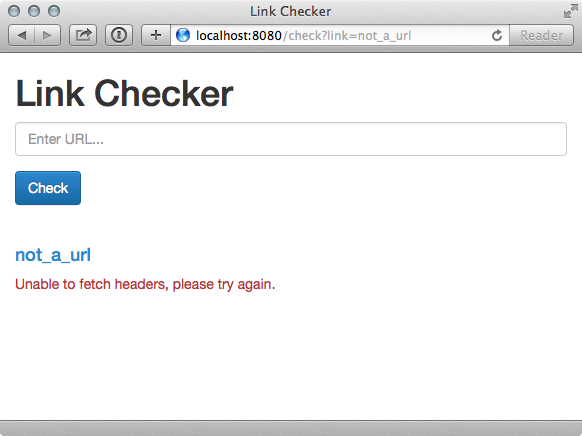

HTTP Header Server
=================================================

For this assignment, you will create a simple Jetty web server that allows users enter a URL, and view the HTTP headers for that URL.

Setup
-------------------------------------------------

Before starting this assignment, you should install Jetty and servlets as a third-party libraries in Eclipse. 

Requirements
-------------------------------------------------

You must do the following for this assignment:

1. **`HTTPHeaderServer.main():`** Start a Jetty web server on port 8080, and map `/check` to the `HeaderServlet` servlet.  
    
2. **`HTTPHeaderServer.HeaderServlet.doGet()`** This servlet should display a simple web form that allows users to enter a link, and press a button to display the HTTP headers for that link.

  If the appropriate link parameter is present in the `GET` request, the servlet should also fetch and display the HTTP headers for the provided link. If the servlet is unable to fetch the headers, display a message on the web page instead. You can use `HTTPFetcher` to get the headers, and display the resulting text in a `pre` block. 

Below is one example for how this assignment might look. You can use any of the servlet code provided as a starting point.

Extra Credit
-------------------------------------------------

You can earn 5 points extra credit on this homework assignment by doing both of the following:

1. Show header fields in a table instead of a single block of text. (1 point)

2. Use [Bootstrap 3.x](http://getbootstrap.com/) to create a responsive mobile-ready website. (2 points)

3. Your HTML code must pass the [W3C HTML Validator](http://validator.w3.org). (2 points)

The examples shown below implement the extra credit features.

Examples
-------------------------------------------------

The following is one example implementation of this assignment. The exact appearance does not need to match this.

When a valid link is provided, the resulting web page might look as follows:

When an invalid link is provided, the resulting web page might look as follows:

Note this is just an example. It is using Bootstrap 3.x and parsing the header fields, but neither of these are requirements for this homework assignment. 

Submission
-------------------------------------------------

There are no unit tests for this homework assignment. It will be graded manually.
